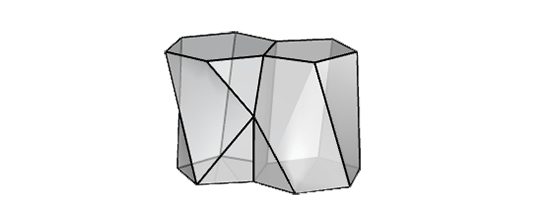

# Scutoid



A package to calculate the volume or surface area of a scutoid in Javascript.

Scutoids are a geometric shape discovered in 2018 that represent the shapes that epithelial cells may take within human tissues. This package helps in calculating their volume and surface area.

## Geometry

The scutoid form is essentially a 3-dimensional shape that has a pentagon on one face and a hexagon on the opposite face, with a characteristic Y-junction on its lateral surface.

- The shape starts with a pentagonal prism as the base structure
- Then a triangular prism is subtracted from one edge
- This creates the transition from pentagon to hexagon across the height

## Installation

```bash
npm i --save scutoid
```

## Usage

First, import the Scutoid class from the package
```js
const Scutoid = require('scutoid');
```

Next, create a new instance of the Scutoid class

```js
const myScutoid = new Scutoid(prismHeight, prismFaceLength, triangleDepth);
```

where:
- `prismHeight` - height of the pentagonal prism, i.e., the overall height of the scutoid

- `prismFaceLength` - length of each face of the regular pentagon, from the pentagonal prism that will later become a scutoid

- `triangleDepth` - depth of the triangular prism, which is subtracted from the pentagonal prism, to create the scutoid


Once the scutoid instance is created, you can calculate its volume and surface area by supplying numbers as arguments:
```js
const volume = myScutoid.volume();
const surfaceArea = myScutoid.surface();
```

## Example

```js
const Scutoid = require('scutoid');

const myScutoid = new Scutoid(10, 5, 7);

console.log(`Volume: ${myScutoid.volume()}`);
console.log(`Surface area: ${myScutoid.surface()}`);
```

## Development and Testing

This project uses mocha for testing. 
Run tests with `npm test`.

#### TBD

- Support irregular top and bottom prism faces
- Consider adding prisma, tronco, frustum, prismatoide, escutoide
- Tests with Mocha
